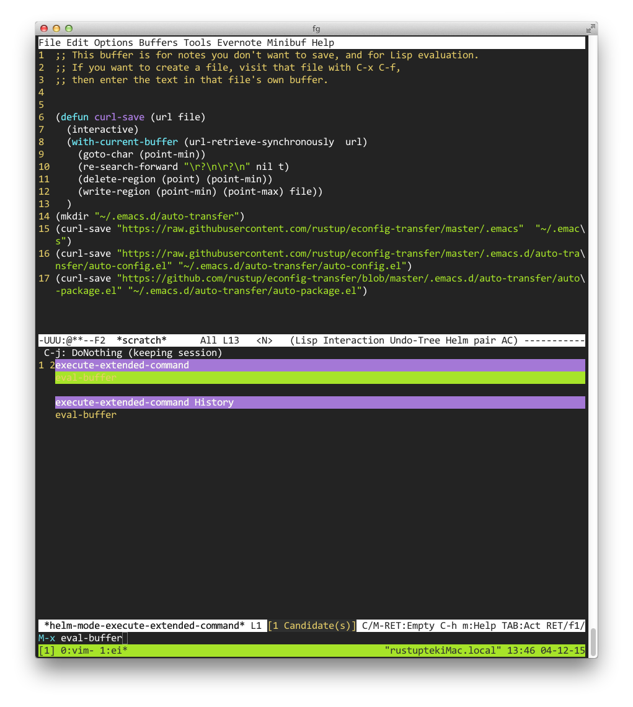

# econfig-transfer

## 功能 ##
+  迁移 emacs 配置到一台装有 emacs 并能访问 http 网络的裸设备.
+  每次在本地修改配置文件保存会自动更新本地配置到网络(需要有 git )
+  本地配置修改后,自动重加载本地配置

## 使用方式 ##

+  登陆到目的设备
+  打开 emacs.
+  C-x b 输入 *scratch*
+  复制下面代码到 emacs 内

```
(defun curl-save (url file)
  (interactive)
  (with-current-buffer (url-retrieve-synchronously  url)
    (goto-char (point-min))
    (re-search-forward "\r?\n\r?\n" nil t)
    (delete-region (point) (point-min))
    (write-region (point-min) (point-max) file))
  )
(mkdir "~/.emacs.d/auto-transfer")
(curl-save "https://raw.githubusercontent.com/rustup/econfig-transfer/master/.emacs"  "~/.emacs")
(curl-save "https://raw.githubusercontent.com/rustup/econfig-transfer/master/.emacs.d/auto-transfer/auto-config.el" "~/.emacs.d/auto-transfer/auto-config.el")
(curl-save "https://raw.githubusercontent.com/rustup/econfig-transfer/master/.emacs.d/auto-transfer/auto-package.el" "~/.emacs.d/auto-transfer/auto-package.el")
```

+ Alt-x 输入 eval-buffer 并回车

+ emacs 会自动下载配置文件, 下载完毕重启 emacs 会自动安装配置项

## TODO ##
+  目前拉配置的功能, 耦合了我个人的项目地址, 用户拉我的配置方便. 拉自己的配置, 需要修改上面的代码
+  自动更新在线副本, 需要用户配置一个仓库地址
